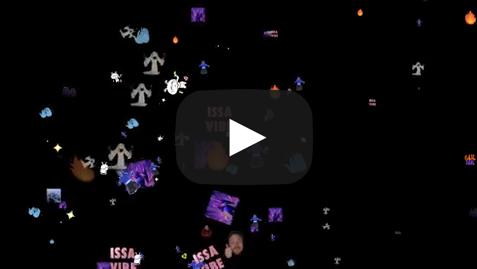

# Twitch Chat Emotes Animated Overlay

## What is this?

This is a **Twitch OBS overlay** that brings your chat to life by displaying emotes floating across the screen. It acts as an emote wall or an animated stream of emotes. It is optimized for performance (tested with 1000+ emotes) and runs entirely client-side.

## Demo

This demo is using Random emote size and Random effect. Great for DJ streams.

**Features:**
*   **Native & Third-Party Support:** Works with Twitch, BetterTTV, SevenTV, and FrankerFacez emotes.
*   **Performance:** Lightweight and optimized for OBS.
*   **Customizable:** Control speed, size, duration, and animation effects (Grow, Rotate, Skew, Float Up/Down).
*   **No Server Required:** Runs using HTML, CSS, and JavaScript.

## Configuration Generator

You can easily generate your overlay URL using the hosted configuration tool:
[**https://twitch-chat-emotes.pages.dev/**](https://twitch-chat-emotes.pages.dev/)

## URL Parameters

Configure the overlay by adding these parameters to the URL.

| Parameter | Type | Default | Description |
| :--- | :--- | :--- | :--- |
| `channel` | **Required** | | Your main Twitch channel name. |
| `bot` | Optional | | If set, only displays emotes from this specific user/bot. |
| `speed` | Integer | `5000` | Transition/Animation speed in milliseconds (5000 = 5s). |
| `duration` | Integer | `5000` | How long emotes stay on screen in milliseconds. |
| `size` | String/Int | `2` | Twitch emote size: `1` (28px), `2` (56px), `3` (112px), or `random`. |
| `customsize` | Integer | `0` | Force a specific pixel size (e.g., `50` for 50px). Overrides `size`. |
| `effect` | String | `fade` | Animation: `grow`, `rotate`, `skew`, `bottom_top`, `top_bottom`, `random`. |
| `fishtank` | Boolean | `false` | If `true`, emotes persist on screen indefinitely until refreshed. |
| `emoteLimit` | Integer | `50` | Max number of emotes to show per chat message. |
| `bttv` | Boolean | `false` | Enable BetterTTV emotes. |
| `7tv` | Boolean | `false` | Enable SevenTV emotes. |
| `ffz` | Boolean | `false` | Enable FrankerFacez emotes. |

**Example URL:**
`http://example.com/bot.html?channel=MrStreamer&speed=5000&duration=15000&size=3&effect=grow&bttv=true&7tv=true`

## How to use in OBS

1.  **Add Source:** Add a new **Browser** source in OBS.
2.  **URL:** Paste your generated URL into the URL field.
3.  **Dimensions:** Set Width to **1920** and Height to **1080**.

**Tips:**
*   Try to avoid using a speed less than 5000 (5 seconds) for smoother performance.
*   You can set the browser source frame-rate from 30 to 60 if the animation seems to stutter.
*   You may want to turn on unique-chat mode on Twitch to prevent spam. Type `/uniquechat` into your chat to toggle.

## Setup (Self-Hosted)

Just clone or download the repo and open **"bot.html"** in your browser.

**No web server needed!** Everything runs client-side using plain old javascript, html and css.

You can set the browser source to "Local File" in OBS and point it to the `bot.html` file in your downloaded folder.
